<center>


**Department of Electronic and Computer Engineering **

**Hong Kong University of Science and Technology**
</center>

# Planar Homographies

### ELEC 5630 - First Principles of Cumputer Vision
*  Assignment **2**
* Professor: **TAN, Ping**

* Developed by: **Erfan RADFAR**
* **Fall 2025**


## Project Overview
This project implements an Augmented Reality (AR) application using planar homographies as part of the ELEC 5630 course (Fall 2025). The implementation follows a step-by-step approach, covering the theory of planar homographies, feature matching, homography estimation, image warping, and AR application development. All scripts and functions are located in the `python/` directory, and resulting images are saved in the `results/` directory.

## Environment
- **Python Version:** 3.8 or higher
- **Dependencies:**
  - OpenCV (`cv2`)
  - NumPy (`numpy`)
  - Matplotlib (`matplotlib`)
  - SciPy (`scipy`) (for `computeH_ransac.py`)
- **Installation:**
  ```bash
  pip install opencv-python numpy matplotlib scipy
  ```

## File Structure
- `python/`: Contains all project scripts and functions.
  - `__init__.py`: Empty file to mark the directory as a Python package.
  - `briefRotTest.py`: Tests BRIEF feature matching with rotation using FAST and SIFT detectors.
  - `compositeH.py`: Combines warped template and target images using homography.
  - `computeH.py`: Computes homography without normalization (Q2.3).
  - `computeH_norm.py`: Computes normalized homography (Q2.4).
  - `computeH_ransac.py`: Implements RANSAC for robust homography estimation (Q2.5).
  - `HarryPotterize_auto.py`: Automates the AR application to "HarryPotterize" an image (Q2.6).
  - `main.py`: Matches features between images using FAST and BRIEF (Q2.1).
  - `matchPics.py`: Extracts and matches features between two images.
  - `warpH.py`: Warps an image using a homography matrix.
- `data/`: Contains input images (e.g., `cv_cover.jpg`, `cv_desk.png`, `hp_cover.jpg`, `hp_desk.png`).
- `results/`: Contains all output images generated by the scripts.

## Running the Code
1. Ensure all dependencies are installed.
2. Place input images in the `data/` directory.
3. Run individual scripts from the `python/` directory:
   - `python main.py`: Generates `2_1_FAST_and_BRIEF.jpg` showing matched features.
   - `python briefRotTest.py`: Generates `2_2_BRIEF_with_Rot_{0,100,200,300}_degree.jpg` and histograms `2_2_Rot_Hist_FAST.jpg`, `2_2_Rot_Hist_SIFT.jpg`.
   - `python computeH.py`: Generates `2_3_Match_between_Groundtruth_and_Transformed.jpg`.
   - `python computeH_norm.py`: Generates `2_4_Match_using_normalized_H.jpg`.
   - `python computeH_ransac.py`: Generates `2_5_Match_using_RANSAC.jpg`.
   - `python HarryPotterize_auto.py`: Generates `2_6_Warped_HarryPotter.jpg` and `2_6_Composite_image.jpg`.

## Results
### Q2.1: Feature Matching with FAST and BRIEF
- **Output:** `results/2_1_FAST_and_BRIEF.jpg`
- **Description:** Displays matched features between `cv_cover.jpg` and `cv_desk.png` using FAST and BRIEF, showing the top 40 matches.
<center>
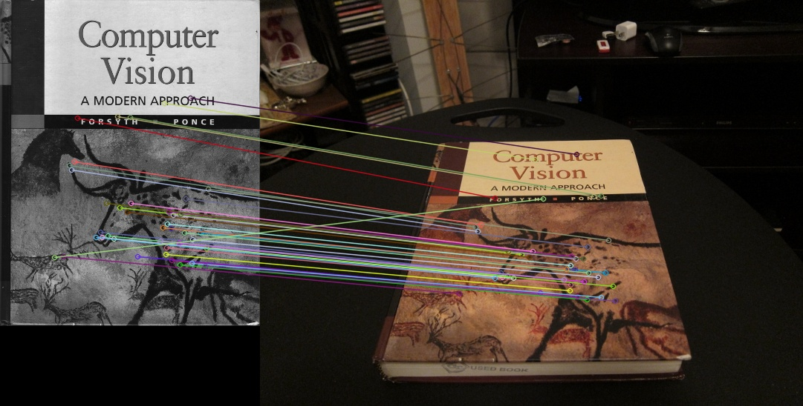
</center>

### Q2.2: Rotation Test with BRIEF
- **Outputs:**
  - `results/2_2_BRIEF_with_Rot_{0,100,200,300}_degree.jpg`: Visualizes matches at 0°, 100°, 200°, and 300 rotations.
  <center>
  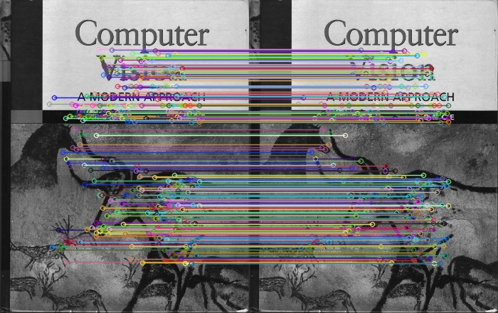
  </center>
  <center>
  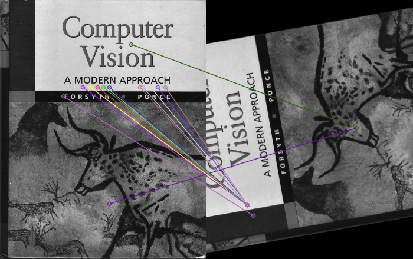
  </center>
  <center>
  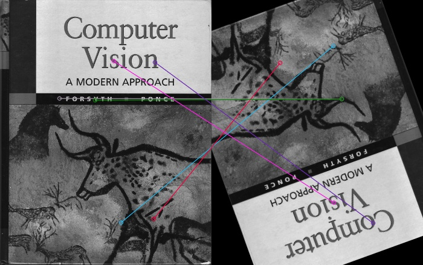
  </center>
  <center>
  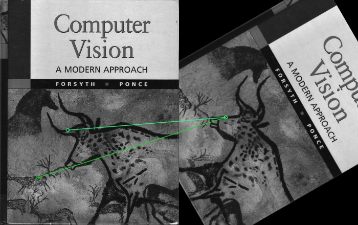
  </center>

  - `results/2_2_Rot_Hist_FAST.jpg`: Histogram of match counts using FAST detector.
  - `results/2_2_Rot_Hist_SIFT.jpg`: Histogram of match counts using SIFT detector.

  <center>
  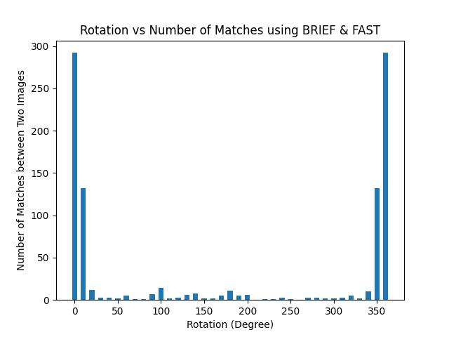
  </center>
  <center>
  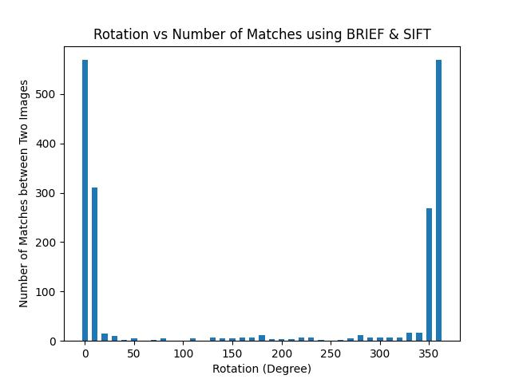
  </center>
- **Description:** Tests BRIEF feature robustness to rotation with FAST and SIFT detectors, plotting match counts vs. rotation angles.<br>
As it can be seen despite using different feature detection algorithm, BRIEF cannot perform well after 20° rotation. The main reason is how BRIEF defines its decriptors.<br> All pixels in the local region are variant to the orientation they have. If image rotates, the descriptive pixels also rotate and reach a new position. Therefore, their value change and they are no more near the previous value they had in the original image.<br>
That is why algorithms such ORB (Oriented FAST and Rotated BRIEF) are more robust and preferred.
On the other hand if you use SIFT keypoint detector and descriptor, it would be invariant to
rotation. Because the SIFT descriptor is based on gradients histogram of local patches.<br>
Also, each keypoint (selected patches) dominant gradient is recorded as angle of that keypoint; meaning that each descriptor is first rotated based on the keypoint angle and then compared. Because these angles are invariant to rotation, the descriptors are first aligned properly and then matched, compensating for image rotation..

### Q2.3: Homography Estimation without Normalization
- **Output:** `results/2_3_Match_between_Groundtruth_and_Transformed.jpg`
- **Description:** Shows the transformed `hp_desk.png` aligned with `hp_cover.jpg` using unnormalized homography, with matched points visualized.

<center>
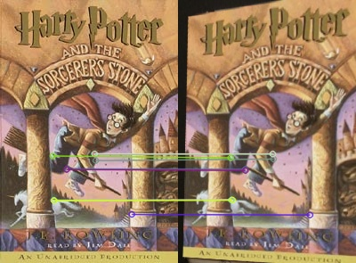
</center>

### Q2.4: Homography Estimation with Normalization
- **Output:** `results/2_4_Match_using_normalized_H.jpg`
- **Description:** Displays the transformed `hp_desk.png` aligned with `hp_cover.jpg` using normalized homography, with matched points visualized.

<center>
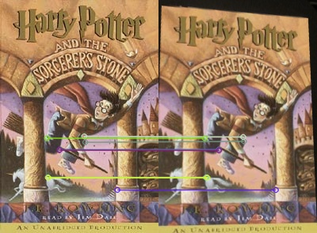
</center>

### Q2.5: RANSAC for Robust Homography
- **Output:** `results/2_5_Match_using_RANSAC.jpg`
- **Description:** Shows the transformed `hp_desk.png` aligned with `hp_cover.jpg` using RANSAC, with inliers (blue) and sampled fitting pairs (green) highlighted.<br> As it can be seen, the transformed picture is more similar to the original cover.


<center>
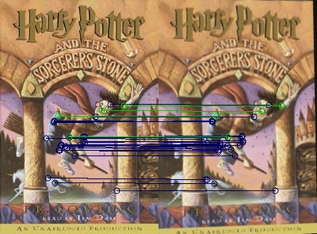
</center>

### Q2.6: HarryPotterize Application
- **Outputs:**
  - `results/2_6_Warped_HarryPotter.jpg`: Warped `hp_cover.jpg` onto `cv_desk.png`.
  - `results/2_6_Composite_image.jpg`: Composite image combining `hp_cover.jpg` with `cv_desk.png`.
- **Description:** Implements an AR application by warping and compositing `hp_cover.jpg` onto `cv_desk.png` using homography.

<center>
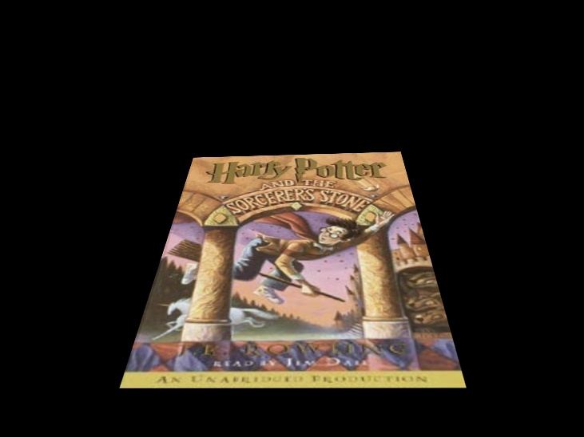
</center>
<center>
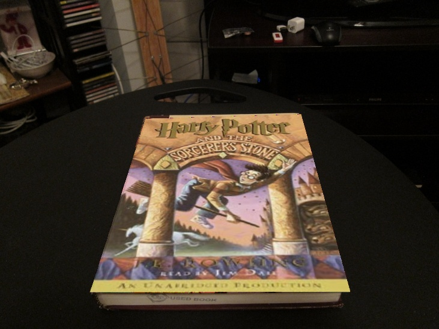
</center>


## References
 https://docs.opencv.org/4.x/db/d27/tutorial_py_table_of_contents_feature2d.html

https://opencv.org/blog/image-rotation-and-translation-using-opencv/


## Notes
- All images are saved in the `results/` directory as specified.

- Ensure input images are correctly placed in the `data/` directory before running the scripts.

