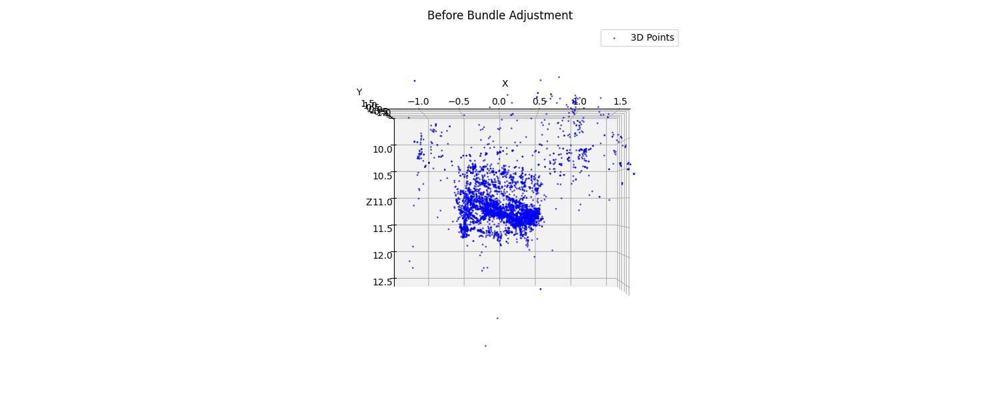
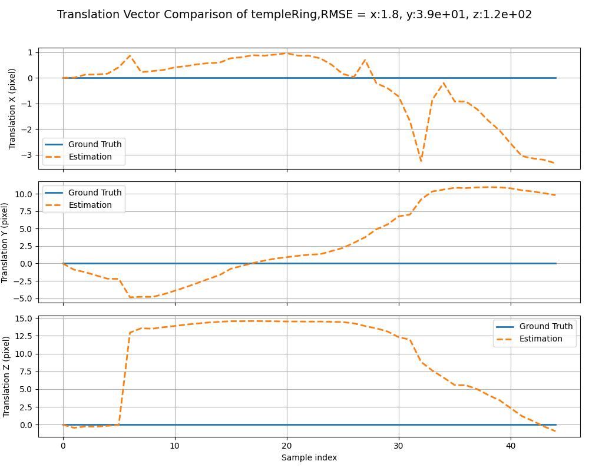
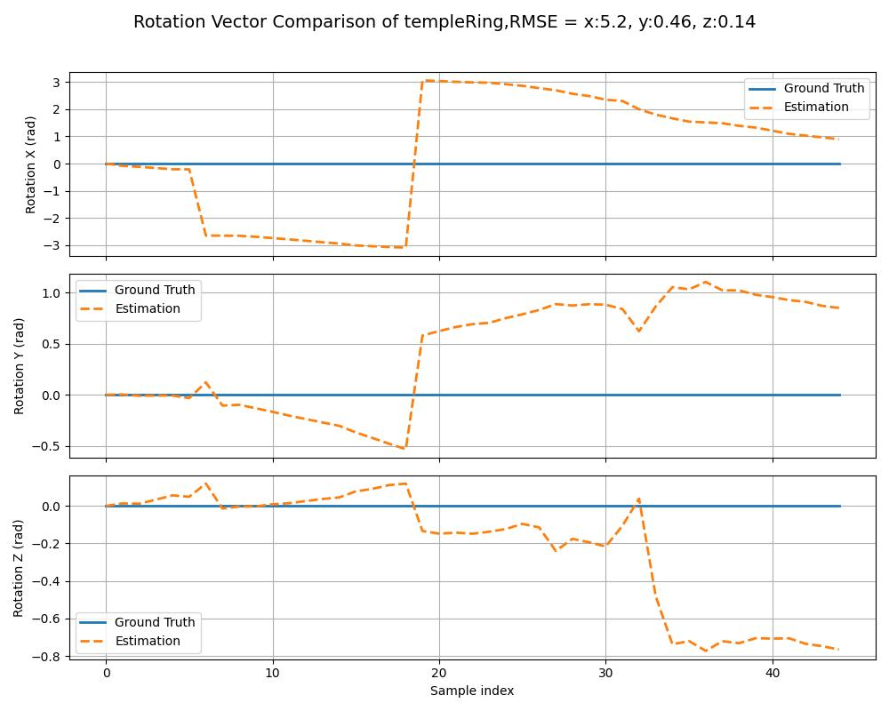
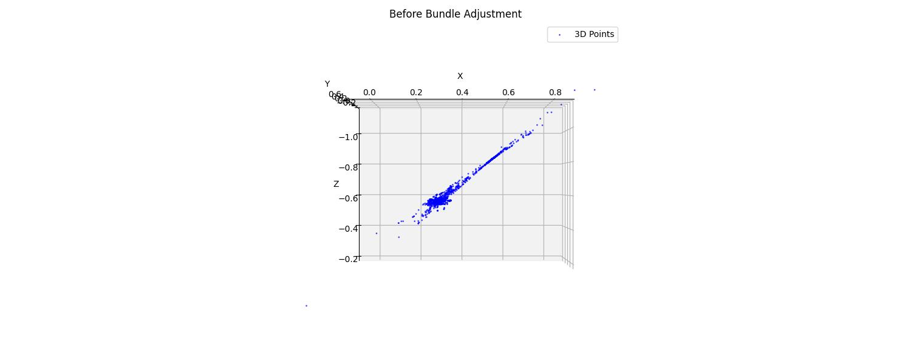
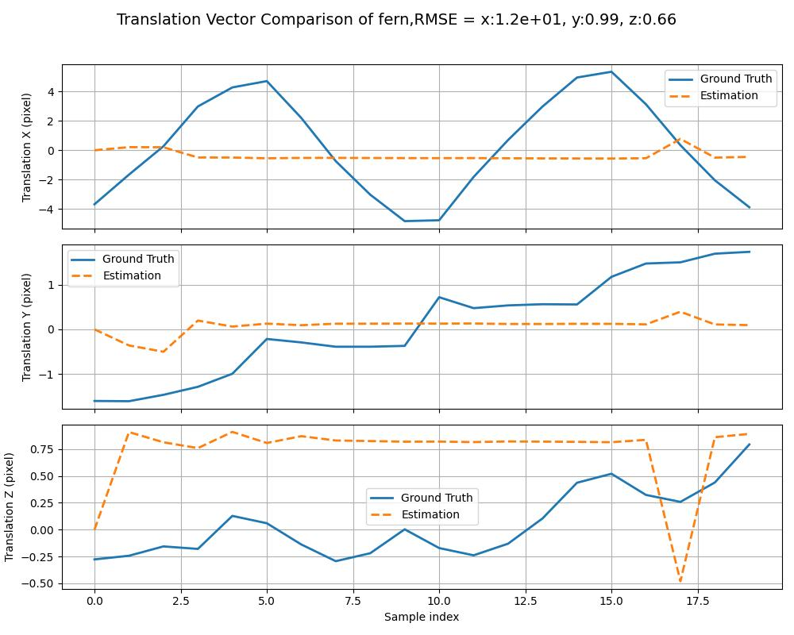
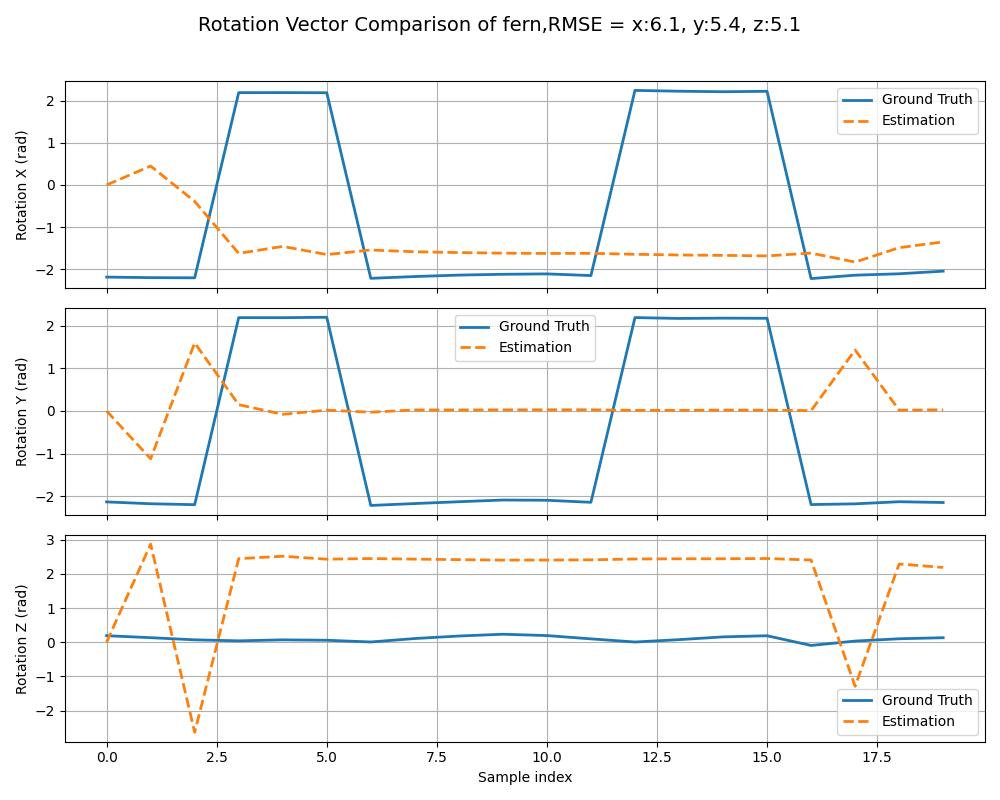
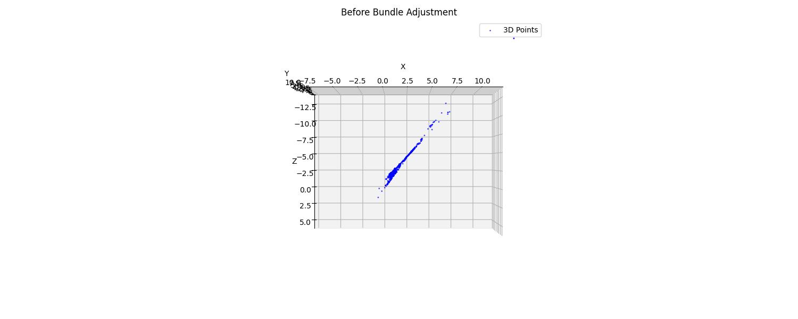
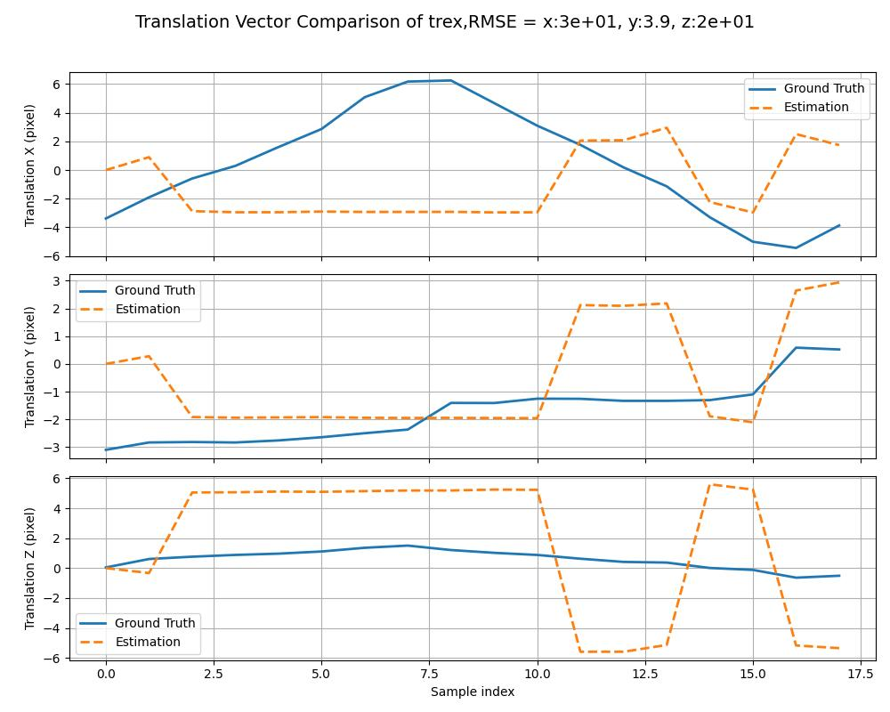
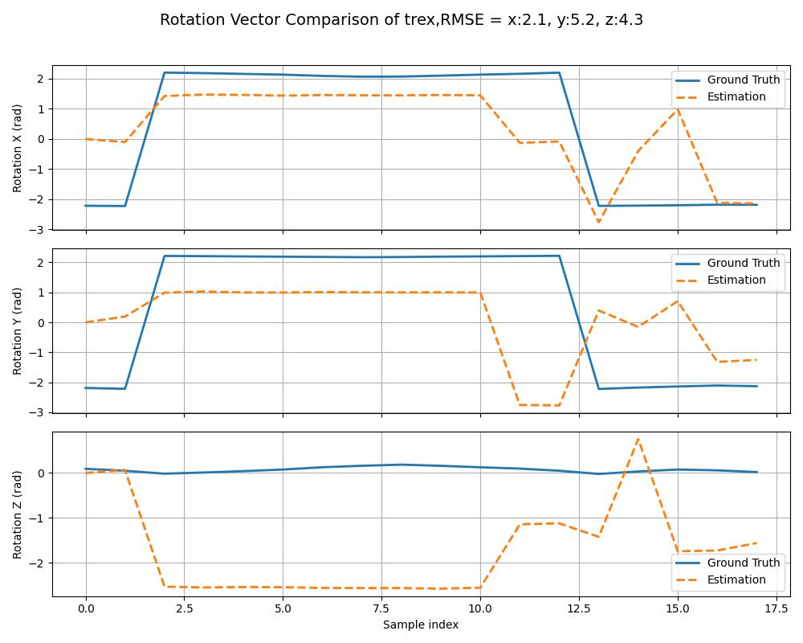

<center>


**Department of Electronic and Computer Engineering**

**Hong Kong University of Science and Technology**
</center>

# Structure from Motion

### ELEC 5630 - First Principles of Cumputer Vision
*  Assignment **2**
* Professor: **TAN, Ping**

* Developed by: **Erfan RADFAR**
* **Fall 2025**
# Structure-from-Motion (SfM) Pipeline for Multi-View 3D Reconstruction

This repository implements a **Structure-from-Motion (SfM)** pipeline using classical computer vision techniques to reconstruct a 3D point cloud and estimate camera poses from a sequence of 2D images. The pipeline includes feature matching, fundamental/essential matrix estimation, relative pose recovery, triangulation, PnP-based incremental reconstruction, and **bundle adjustment** for global optimization.

---

## Features

- **Feature Correspondence** across image pairs
- **Fundamental & Essential Matrix** estimation with RANSAC
- **Camera Pose Recovery** from Essential Matrix
- **Triangulation** of 3D points
- **Incremental SfM** using Perspective-n-Point (PnP)
- **Bundle Adjustment** for joint optimization of structure and motion
- **Visualization** of estimated vs ground-truth camera trajectories
- **3D Point Cloud** rendering with rotating views

---

## Supported Datasets

| Dataset       | Path Format                     | Ground Truth Poses |
|---------------|----------------------------------|--------------------|
| `templeRing`  | `../data/templeRing`             | No                 |
| `fern`        | `../data/fern/images`            | Yes                |
| `trex`        | `../data/trex/images`            | Yes                |

> Note: For `fern` and `trex`, ground truth poses are loaded from `poses_bounds.npy`.

---

## Requirements


pip install opencv-python numpy scipy matplotlib

```
.
├── main.py                     # Main SfM pipeline
├── read_image.py               # Image loading & intrinsics
├── find_correspondence.py      # Feature detection & matching
├── recover_pose.py             # Essential matrix & pose recovery
├── bundle_adjustment.py        # Bundle adjustment implementation
├── data/
│   ├── templeRing/
│   ├── fern/images/
│   ├── fern/poses_bounds.npy
│   ├── trex/images/
│   └── trex/poses_bounds.npy
└── results/
    ├── templeRing/
    ├── fern/
    └── trex/
```

## Pipeline Steps

- Read Images & Camera Intrinsics (K)
- Find Correspondences between consecutive image pairs
- Estimate Fundamental Matrix → Essential Matrix
- Recover Relative Pose (R, t) using cheirality check
- Triangulate Initial 3D Points
- Incremental Reconstruction:
- Use PnP (SQPNP) to estimate new camera pose
- Triangulate new points
- Periodically run Bundle Adjustment

## Evaluate against ground truth (if available)
## Visualize:
- Rotation & translation trajectories
- 3D point cloud with rotating views

# Output
Results are saved in ../results/{data_name}/:

RotComparison_{data_name}.jpg – Rotation vector comparison
TransComparison_{data_name}.jpg – Translation vector comparison
{data_name}_0.jpg to {data_name}_N.jpg – Rotating 3D point cloud views

# Results 
### temple ring




### fern 





### trex




As it can be seen, due to high number of feature in `fern` and  `trex`,
reconstruction cannot is not robust enough. Due to background's corners and high complexity
of leaves in fern and skeleton in trex, feature matches will have so many outliers therefore,
reconstruction would be difficult.
On the other hand, camera movement in fern and trex are almost planar rather than 3D. Consequently, less information can be extracted.

information is accessed
## Non-linear Optimization
For non-linear optimization, SQPNP was used based on the
`George Terzakis and Manolis Lourakis. A consistently fast and globally optimal
solution to the perspective-n-point problem. In European Conference on Computer Vision, pages 478–494. Springer International Publishing, 2020.` work.
They formulated the PnP problem as a non-linear quadratic program and then used
a specific approach to guarantee finding the global minimum,
unlike many other methods that get stuck in local minima. This algorithm was used
in this program for PnP computation.

# References
https://docs.opencv.org/4.x/d5/d1f/calib3d_solvePnP.html
https://www.ecva.net/papers/eccv_2020/papers_ECCV/papers/123460460.pdf

