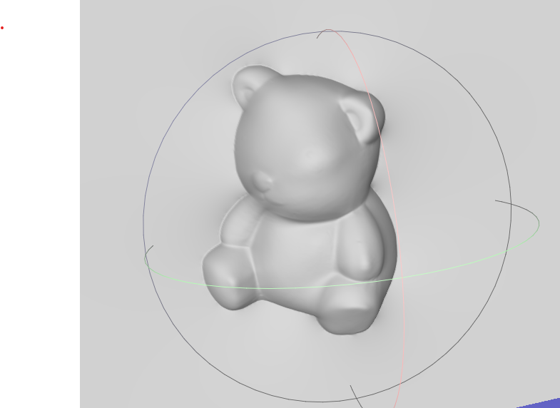

<center>


**Department of Electronic and Computer Engineering**

**Hong Kong University of Science and Technology**
</center>

# Photometric Stereo: 2D Surface to 3D Mesh Converter

### ELEC 5630 - First Principles of Cumputer Vision
*  Assignment **1**
* Professor: **TAN, Ping**

* Developed by: **Erfan RADFAR**
* **Fall 2025**

## Overview
This Python project implements multiple finally photometric stereo pipelines and finally reconstructs the 3D surfaces from 2D images and convert them into 3D meshes.

 It processes photometric stereo datasets (images under varying lighting conditions) to estimate surface normals, reconstruct depth maps, and generate 3D meshes in STL format.
 
  The project supports multiple photometric stereo methods: Least Squares-Based, Robust Photometric Stereo, and PCA-Based, and includes visualization and export functionalities.
<table>
  <tr>
    <td></td>
    <td></td>
    <td></td>
  </tr>
</table>

## Features
- **Photometric Stereo**: Estimates surface normals using three methods:
  - Least Squares-Based Photometric Stereo (`myPMS.py`).
  - Robust Photometric Stereo with shadow/highlight rejection (`myRobustPMS.py`).
  - PCA-Based Photometric Stereo for low-rank approximation (`myPCA.py`).
- **Depth Reconstruction**: Converts normal maps to depth maps using the Frankot-Chellappa algorithm (`mynormal2depth.py`).
- **3D Mesh Generation**: Converts 2D depth maps to 3D meshes and exports them as STL files (`surface2mesh` in `mynormal2depth.py`).
- **Data Loading**: Loads photometric stereo datasets (images, light directions, intensities, and masks) with support for resizing and gamma correction (`load_datadir_re.py`).
- **Visualization**: Generates plots for normal maps and 3D surfaces.
- **Output Formats**: Saves normal maps as images and Excel files, and 3D meshes as STL files.

## Requirements
- Python 3.8+
- Required Python packages (listed in `requirements.txt`):
  - `opencv-python==4.9.0.80`
  - `numpy==1.26.4`
  - `open3d`
  - `scikit-image==0.23.2`
  - `scipy==1.13.0`
  - `numba`
  - `matplotlib`
  - `mpl_toolkits`
  - `trimesh`
  - `sklearn`


## Dataset Preparation
The project expects a dataset directory (`../pmsData`) containing subdirectories for each object (e.g., `BearPNG`, `CatPNG`, `PotPNG`, `BuddhaPNG`). Each subdirectory should include:
- **Images**: PNG files of the object under different lighting conditions (listed in `filenames.txt`).
- `light_directions.txt`: A text file with light direction vectors.
- `light_intensities.txt`: A text file with light intensity values.
- `mask.png`: A grayscale mask image to delineate the object from the background.
- `filenames.txt`: A text file listing the paths to the image files.

Ensure the dataset is placed in the `../pmsData` directory relative to the project root.

## Usage
1. **Run the Main Script**:
   ```bash
   python mainBaseline.py
   ```
   This processes four objects (`Bear`, `Cat`, `Pot`, `Buddha`) using three photometric stereo methods and generates:
   - Normal map images (`*.png`) and Excel files (`*.xlsx`) for each method.
   - 3D surface plots (`Object <ID+1> - 3D surface.png`).
   - 3D mesh files in STL format (`Object-<ID+1> surface_mesh.stl`).

2. **Output Directory**:
   - Results are saved in the `../results` directory (created automatically if it doesn't exist).
   - Ensure the `../results` directory is writable.

3. **Customization**:
   - **Dataset**: Modify `dataNameStack` in `mainBaseline.py` to process different objects or update the dataset path.
   - **Image Size**: Adjust `resize = (512, 612)` in `mainBaseline.py` to change the output resolution.
   - **Photometric Stereo Parameters**:
     - Robust Photometric Stereo: Change `ratio = 0.2` in `mainBaseline.py` to adjust the discard ratio for shadows/highlights.
     - PCA-Based: Change `rank = 3` in `mainBaseline.py` to adjust the rank for PCA decomposition.
   - **Depth Reconstruction**: Modify the `mynormal2depth.py` function to use a different photometric stereo method for depth reconstruction (currently uses PCA with rank 3).

## Example
The script processes the `Bear`, `Cat`, `Pot`, and `Buddha` datasets and produces:
- Normal map visualizations (e.g., `Least Squares-Based_1.png`, `ratio 0.2 Robust Photometric Stereo_1.png`, `rank 3 PCA-Based_1.png`).
- Normal map data in Excel format (e.g., `Least Squares-Based_normal_vectors_1.xlsx`).
- 3D surface plots (e.g., `Object 1 - 3D surface.png`).
- 3D meshes (e.g., `Object-1 surface_mesh.stl`).

To visualize the STL files, use software like MeshLab.

## File Structure
- `mainBaseline.py`: Main script to run the photometric stereo pipeline and generate results.
- `load_datadir_re.py`: Loads and preprocesses photometric stereo dataset (images, light directions, intensities, and mask).
- `myPMS.py`: Implements Least Squares-Based Photometric Stereo.
- `myRobustPMS.py`: Implements Robust Photometric Stereo with shadow/highlight rejection.
- `myPCA.py`: Implements PCA-Based Photometric Stereo.
- `mynormal2depth.py`: Converts normal maps to depth maps and generates 3D meshes.
- `requirements.txt`: Lists required Python packages.
- `../pmsData/`: Expected directory for input datasets (not included in the repository).
- `../results/`: Output directory for normal maps, surface plots, and 3D meshes.

## Dependencies
- **OpenCV**: For image processing.
- **NumPy**: For numerical computations and array operations.
- **Open3D**: For potential 3D processing (not used in current code but listed in requirements).
- **scikit-image**: For image processing utilities.
- **SciPy**: For scientific computations, including saving to `.mat` files.
- **Numba**: For performance optimization (not explicitly used but listed in requirements).
- **Matplotlib**: For visualizing normal maps and 3D surfaces.
- **trimesh**: For creating and exporting 3D meshes.
- **scikit-learn**: For PCA in the PCA-Based method.

## Notes
- **Sphere Normals**: The `sphere_normals` function in `mainBaseline.py` generates reference normals for a sphere, which are added to the computed normals. Adjust the `radius` and `center` parameters if needed.
- **Performance**: For large datasets or high-resolution images, reduce the `resize` dimensions to avoid memory issues.
- **Output Formats**: Normal maps are saved as both PNG images and Excel files. Uncomment the `.mat` saving code in `save_results` if MATLAB compatibility is needed.
- **Visualization**: The 3D surface plots use Matplotlib’s `Axes3D`. For better 3D visualization, consider using external tools for STL files.


## References


- Frankot, R. T., & Chellappa, R. (1988). "A Method for Enforcing Integrability in Shape from Shading Algorithms." IEEE Transactions on Pattern Analysis and Machine Intelligence, 10(4), 439–451. DOI: 10.1109/34.3913


  Describes the `Frankot-Chellappa` algorithm for surface reconstruction from gradients, implemented in mynormal2depth.py.


- `Trimesh` Documentation. (n.d.). https://trimsh.org/


  Reference for the trimesh library used for 3D mesh generation in mynormal2depth.py.
## License
This project is licensed under the MIT License. See the `LICENSE` file for details (not included in the provided files, but recommended).