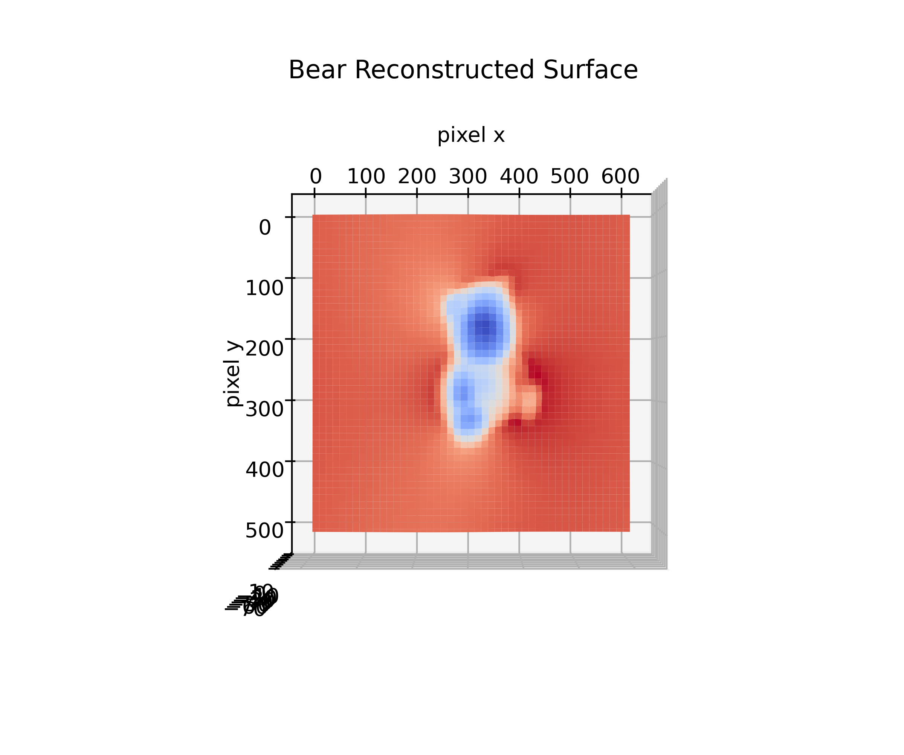
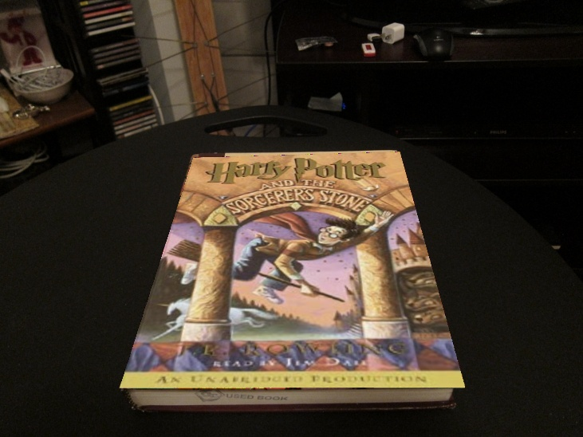
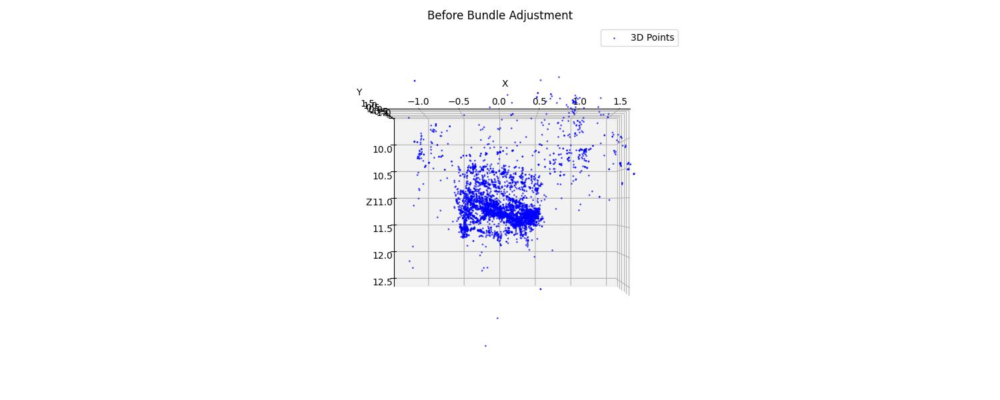
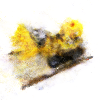
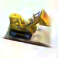
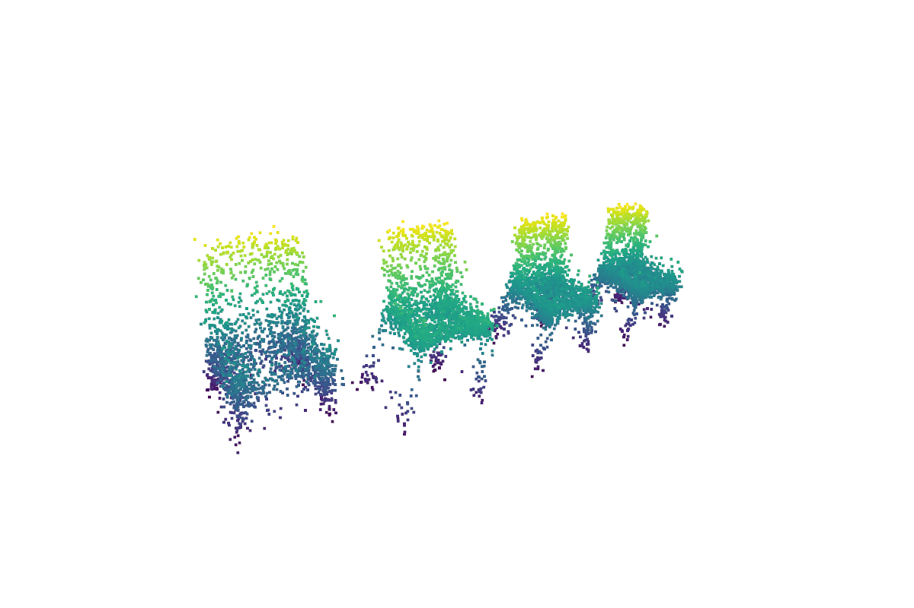
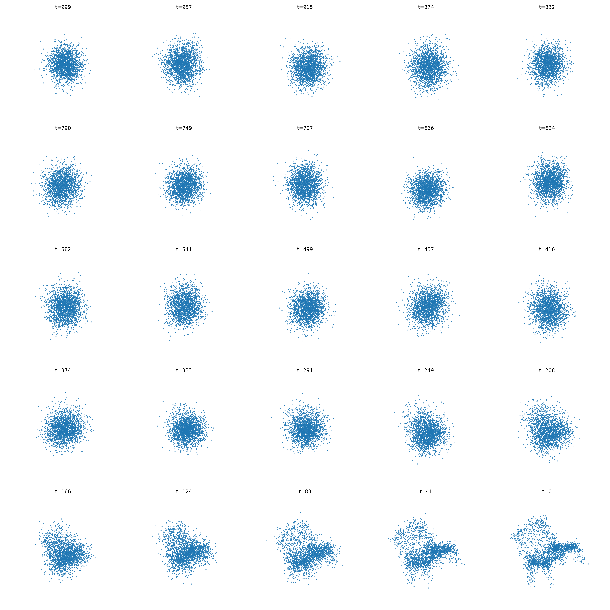

# ELEC 5630 — First Principles of Computer Vision


<p align="center">
  <strong>Hong Kong University of Science and Technology</strong><br>
  Department of Electronic and Computer Engineering<br>
  <em>Fall 2025 · Professor: Tan, Ping</em>
</p>

This repository contains the five course projects developed for **ELEC 5630 — First Principles of Computer Vision**. Together, the projects form a progression from classical two-view geometry and image-based 3D reconstruction to modern neural and generative 3D representations.

Each project is maintained in its own branch. The `main` branch serves as an overview and entry point to the complete project collection.

---

## Projects at a Glance

| # | Project | Main Topics | Branch |
|---|---|---|---|
| **1** | **Photometric Stereo** | Surface normals, depth reconstruction, 3D meshes | [`1-Photometric-Stereo`](tree/1-Photometric-Stereo) |
| **2** | **Planar Homographies** | Feature matching, homography estimation, RANSAC, augmented reality | [`2-Planar-Homographies`](tree/2-Planar-Homographies) |
| **3** | **Structure from Motion** | Feature correspondence, camera pose, triangulation, PnP, bundle adjustment | [`3-Structure-from-Motion`](tree/3-Structure-from-Motion) |
| **4** | **NeRF and 3D Gaussian Splatting** | Neural rendering, volume rendering, Gaussian primitives | [`4-NeRF-and-GS`](tree/4-NeRF-and-GS) |
| **5** | **3D Generation with Point Cloud Diffusion** | DDPMs, PointNet-style networks, point-cloud generation | [`5--3D-Generation--Point-Cloud-Diffusion-Model`](tree/5--3D-Generation--Point-Cloud-Diffusion-Model) |

---

## Course Project Collection

### 1. Photometric Stereo — 2D Surface to 3D Mesh

**Branch:** [`1-Photometric-Stereo`](tree/1-Photometric-Stereo)

The first project reconstructs 3D surfaces from multiple 2D images captured under varying lighting conditions. It implements several photometric stereo approaches for estimating surface normals, followed by depth reconstruction and 3D mesh generation.

Implemented methods include:

- **Least Squares Photometric Stereo**
- **Robust Photometric Stereo** with shadow/highlight rejection
- **PCA-Based Photometric Stereo**
- **Frankot–Chellappa** integration for normal-to-depth reconstruction
- 3D surface visualization and **STL mesh export**

The project processes objects such as Bear, Cat, Pot, and Buddha and produces normal maps, depth/surface visualizations, and 3D meshes.

**Representative result:**

<p align="center">
  
</p>

---

### 2. Planar Homographies — From Feature Matching to Augmented Reality

**Branch:** [`2-Planar-Homographies`](tree/2-Planar-Homographies)

The second project studies planar projective geometry and builds an augmented-reality pipeline around image homographies. The implementation progresses from local feature matching to robust geometric estimation and image compositing.

Key components include:

- FAST and BRIEF feature detection/matching
- BRIEF rotation robustness experiments
- Homography estimation with and without normalization
- **RANSAC** for robust homography estimation
- Image warping
- A `HarryPotterize` augmented-reality application

The final pipeline demonstrates how a planar image can be detected, warped, and composited into another scene.

**Representative result:**

<p align="center">
  
</p>

---

### 3. Structure from Motion — Multi-View 3D Reconstruction

**Branch:** [`3-Structure-from-Motion`](tree/3-Structure-from-Motion)

The third project extends geometric reconstruction from a planar transformation to full multi-view **Structure-from-Motion (SfM)**. Given a sequence of images, the pipeline estimates camera motion and reconstructs a 3D point cloud.

The pipeline includes:

1. Image and camera-intrinsic loading
2. Feature correspondence between image pairs
3. Fundamental and essential matrix estimation using RANSAC
4. Relative camera-pose recovery
5. Initial 3D triangulation
6. Incremental reconstruction using **PnP**
7. Periodic **bundle adjustment**
8. Camera-trajectory and point-cloud visualization

The implementation supports the `templeRing`, `fern`, and `trex` datasets, with ground-truth pose evaluation available for the latter two.

**Representative result:**

<p align="center">
  
</p>

---

### 4. Novel View Synthesis — NeRF and 3D Gaussian Splatting

**Branch:** [`4-NeRF-and-GS`](tree/4-NeRF-and-GS)

The fourth project moves from classical geometry to **neural rendering**, implementing two approaches for novel-view synthesis on the Blender `lego` dataset:

- **Classic NeRF** using positional encoding and volume rendering
- **3D Gaussian Splatting (3DGS)** using explicit anisotropic Gaussian primitives and differentiable rasterization

The project provides complete training pipelines and compares the two representations in terms of reconstruction quality and computational efficiency. The implementation includes stratified ray sampling, NeRF volume rendering, Gaussian projection, tile-based rasterization, PSNR logging, and result visualization.

The reported experiments highlight the practical difference between the two paradigms: NeRF provides high-quality implicit scene representation but is comparatively slow, while 3DGS provides an explicit representation with fast training and real-time-capable rendering.

**Representative results:**

<p align="center">
  
  
</p>

---

### 5. 3D Generation — Point Cloud Diffusion Model

**Branch:** [`5--3D-Generation--Point-Cloud-Diffusion-Model`](tree/5--3D-Generation--Point-Cloud-Diffusion-Model)

The fifth project explores **generative modeling for 3D point clouds** using a denoising diffusion framework combined with a simplified PointNet-style architecture.

The system includes:

- Linear and cosine diffusion schedules
- Forward noising and reverse denoising processes
- A PointNet-inspired noise-prediction network
- Shared point-wise MLPs and global max pooling
- Time-step conditioning
- ShapeNet data loading with normalization and resampling to 2048 points
- Chamfer Distance, Minimum Matching Distance (MMD), and nearest-neighbor evaluation
- 3D point-cloud visualization and denoising-process visualization

The model takes point clouds of shape `(B, N, 3)` and predicts per-point noise with the same output shape.

**Representative results:**

<p align="center">
  
  
</p>

---

## From Classical Vision to Generative 3D

The five projects can also be viewed as a progression through several generations of computer-vision techniques:

```text
2D Image Correspondence
        │
        ▼
Planar Geometry
Planar Homographies
        │
        ▼
Multi-View Geometry
Structure from Motion
        │
        ▼
Image-Based 3D Reconstruction
Photometric Stereo
        │
        ▼
Neural Scene Representation
NeRF + 3D Gaussian Splatting
        │
        ▼
Generative 3D Modeling
Point Cloud Diffusion
