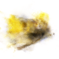
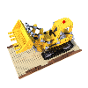
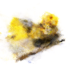
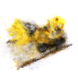
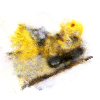
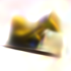
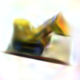
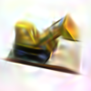

<center>


**Department of Electronic and Computer Engineering**

**Hong Kong University of Science and Technology**
</center>

#  Novel View Synthesis with Neural Radiance Fields & 3D Gaussian Splatting

### ELEC 5630 - First Principles of Cumputer Vision
*  Assignment **4**
* Professor: **TAN, Ping**

* Developed by: **Erfan RADFAR**
* **Fall 2025**

#  

Neural Radiance Fields (NeRF) pioneered photorealistic novel-view synthesis by representing 3D scenes as continuous, implicit functions learned via MLPs from multi-view images. While groundbreaking, NeRF suffers from slow training and rendering speeds, high memory usage, and limited compatibility with traditional graphics pipelines.

3D Gaussian Splatting (3DGS) emerged as a powerful explicit alternative: instead of implicit neural fields, it models scenes using millions of anisotropic 3D Gaussians with learnable position, scale, rotation, opacity, and spherical harmonics color. These primitives are projected and rasterized differentiably on the GPU, achieving dramatically faster training (minutes vs. hours) and real-time rendering (>100 FPS) while maintaining comparable or superior visual quality.

This project implements both paradigms from scratch in PyTorch — a full classic NeRF with positional encoding and volume rendering, alongside a complete 3D Gaussian Splatting pipeline with tile-based rasterization — enabling direct comparison of implicit vs. explicit scene representations on the standard "lego" dataset. It clearly demonstrates the evolution from slow, high-quality implicit modeling (NeRF) to fast, editable, real-time explicit representations (3DGS), highlighting the current state-of-the-art shift toward efficient, graphics-friendly neural scene primitives.


This repository contains **two complete training pipelines**:
- `train_3d_nerf.py` → Classic positional-encoding NeRF (volume rendering)
- `train_gs.py` → Modern 3D Gaussian Splatting (differentiable rasterization)

Both render the same `lego` scene and save results to `../output/`.

---

### Features

| Feature                         | Implemented? | Notes |
|-------------------------------|--------------|-------|
| Positional Encoding            | Yes          | Custom class, supports arbitrary bounds |
| Stratified ray sampling        | Yes          | With perturbation |
| Hierarchical sampling (optional) | No           | Not needed for basic version |
| Classic NeRF volume rendering  | Yes          | With Softplus density |
| 3D Gaussian primitives         | Yes          | Full SH coloring, scale+rotation+opacity |
| Anisotropic 3D → 2D projection | Yes          | Correct Jacobian + low-pass filter |
| Tile-based rasterizer          | Yes          | Fast, differentiable, front-to-back compositing |
| Training-stable renderer       | Yes          | Clamped Mahalanobis, opacity clamping, safe exp |
| PSNR logging + image saving    | Yes          | Every 50 epochs (NeRF) / every 5 epochs (GS) |

---

### Directory Structure

```
.
├── python/                        # ← All source code lives here
│   ├── train_3d_nerf.py           # Classic NeRF training script
│   ├── train_gs.py                # 3D Gaussian Splatting training script
│   ├── nerf_dataset.py            # Shared dataset loader
│   └── gaussian_splatting/
│       ├── __init__.py
│       ├── gauss_model.py
│       ├── gauss_render.py
│       └── utils/
│           ├── __init__.py
│           ├── camera_utils.py
│           ├── point_utils.py
│           ├── sh_utils.py
│           └── loss_utils.py
│
├── data/                          # ← Place the downloaded dataset here
│   └── lego/
│       ├── transforms_train.json
│       ├── transforms_val.json
│       ├── transforms_test.json
│       └── train/, val/, test/    # image folders
│
├── output/                        # ← Automatically created during training
│   ├── NeRF/                      # NeRF renders + ground truth images
│   │   ├── pred_0.png
│   │   ├── gt_0.png
│   │   ├── ...
|   |   └── terminal.txt
│   └── 3DGS/                      # 3D Gaussian Splatting renders
│       ├── pred_0.png
│       ├── gt_0.png
│       ├── ...
|       └── terminal.txt
│
├── README.md
└── requirements.txt
```

---

### Dataset

Download the NeRF synthetic "lego" dataset from the official source:

https://www.kaggle.com/datasets/rishyparasar/nerf-lego

Extract it so you have:

```
data/lego/
├── transforms_train.json
├── transforms_val.json
├── transforms_test.json
└── train/, val/, test/ (images)
```

---

### How to Run

#### 1. Classic NeRF
```bash
python train_3d_nerf.py
```
- Very slow (~hours on a single GPU)
- You don’t need to wait for convergence — just check that images appear in `output/NeRF/`

#### 2. 3D Gaussian Splatting (Recommended)
```bash
python train_gs.py
```
- Starts producing reasonable results after **~200–500 iterations**
- By ~1000 iterations you’ll see sharp details
- Much faster and more stable than NeRF

---

### Key Implementation Details (Why This Actually Trains)

- `mah2.clamp(-50, 50)` → prevents `exp(+inf)` when Gaussians collapse
- Opacity clamped to `[0, 0.99]` before multiplication
- Used alternative simple-knn (Due to multiple difficulties for installing the c++ based library)
- In `GaussRenderer` class, `self.render_color` should be initilized with zero, else the rendered image pixels would always pass 1 threshold, producing all white image.

---
### Output Results

Here is a visual comparison of the two methods on the **Blender "Lego"** dataset after training.
Also, the PSNR are recorded in `terminal.txt`.

#### NeRF (train_3d_nerf.py)  
Classic neural volume rendering — high fidelity but extremely slow.

| Epoch | Rendered Output | Ground Truth | PSNR |
|-------|------------------|--------------|-----|
| 400   |  |  |   17.46  |
| 800  |  |  |    18.37  |
| 1200  |  |  |  19.25  |
| 1600  |  |  |  20.09  |
| 2000  |  |  |  20.15  |

> Note: NeRF typically reaches **~30–33 PSNR** after 20k+ iterations (several hours).  
> The above images are saved every 50 epochs for demonstration.

#### 3D Gaussian Splatting (train_gs.py)  
Explicit Gaussians + differentiable rasterization — **real-time capable** and converges in minutes.

| Epoch | Rendered Output | Ground Truth | PSNR |
|-------|------------------|--------------|-----|
| 100   |  |  |   16.34   |
| 200   |  |  |   17.15   |
| 300   |  |  |   17.43   |
| 400   |  |  |     17.80   |
| 500   |  |  |    17.69  |


> Note: 3DGS usually exceeds **30–34 PSNR** within (1000 iterations).  
> Images are saved every 5 epochs during training.

**Observations and Analysis**:  
- Even at early stages (epoch 300), 3DGS already produces sharper geometry and less blur than NeRF at epoch 2000 — while rendering at **>100 FPS** after training.

- In 3DGS, after some epochs we may need to early-stop to avoid overfitting.

- Using predetermined cloudpoints of the object, convergence happens earlier in 3DGS; mainly due to 3d points and gaussians accumulation around where actually object exist. Specifically, in the corners which due to their sharp transtion in pixel space, need their own unique and low variance gaussian splat.
The demonstrated results have used the initial cloudpoints.

- Due to the low resolution of training data (100x100 chosen), the final model can only creates the best possible approximation. If higher resolution is chosen, a more detailed approximation can be achieved.(Consequently, more time and memory needed)


### Requirements

```txt
torch>=2.0
torchvision
tqdm
numpy
scikit-image
plyfile
einops
```

Install with:
```bash
pip install torch torchvision tqdm numpy scikit-image plyfile einops
```

---

### References

- Kerbl et al., "3D Gaussian Splatting for Real-Time Radiance Field Rendering", SIGGRAPH 2023  
- Mildenhall et al., "NeRF: Representing Scenes as Neural Radiance Fields for View Synthesis", ECCV 2020  
- Official 3DGS repo: https://github.com/graphdeco-inria/gaussian-splatting

---

